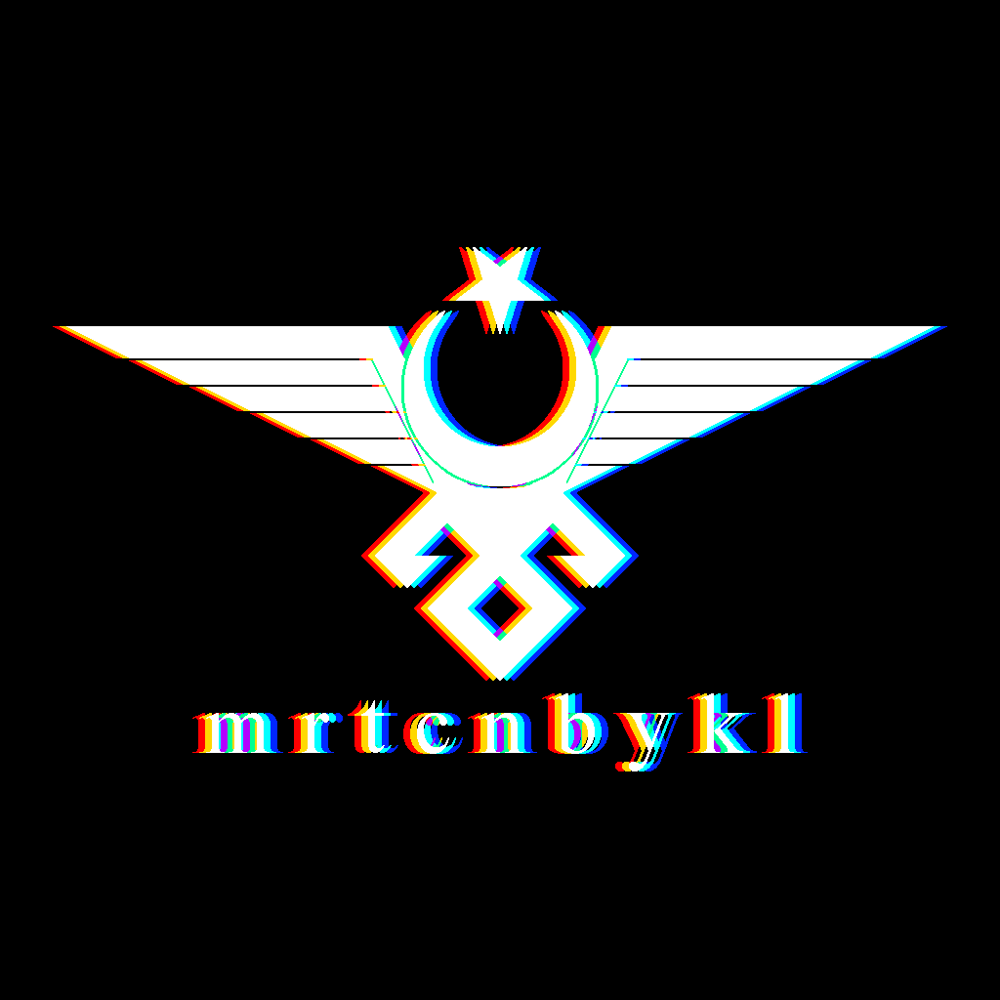

# mrtcnbykl

## *Türkçe*

Adım Mertcan Baykal. Uygulayımbilim ve yazılım alanlarında bağımsız çalışmalar yapan bir Türk bilgisayar mühendisiyim. Çalışmalarımı ***mrtcnbykl*** kullanıcı adı ile yayımlıyorum. Bu sayfayı, çalışmalarımın ulaşılabilirliğini arttırmak amacıyla derleme noktası olarak kullanıyorum.

 

*Adlarındaki bağlantılara tıklayarak GitHub üzerinden çalışmaların içeriklerini görüntüleyebilirsiniz.*

#### Oyunlar

- [Cyberpunk Survivor](https://github.com/mertcanbaykal/mrtcnbykl.CyberpunkSurvivor)
- [Neon Fusion](https://github.com/mertcanbaykal/mrtcnbykl.NeonFusion)

#### Yazı Tipi
- [VCR_OSD_Mono_with_Turkic_Cyrillic](https://github.com/mertcanbaykal/mrtcnbykl.VCR_OSD_Mono_with_Turkic_Cyrillic)

### İletişim
*mrtcnbykl@gmail.com*

 

## *English*

My name is Mertcan Baykal. I'm a Turkish software engineer who works independently on projects in the fields of technology and software. I publish my work under the username ***mrtcnbykl***. I use this page as a center hub to increase the accessibility of my work.

 

*You can view the contents of my works on GitHub by clicking on the links on their names.*

#### Games

- [Cyberpunk Survivor](https://github.com/mertcanbaykal/mrtcnbykl.CyberpunkSurvivor)
- [Neon Fusion](https://github.com/mertcanbaykal/mrtcnbykl.NeonFusion)

#### Font
- [VCR_OSD_Mono_with_Turkic_Cyrillic](https://github.com/mertcanbaykal/mrtcnbykl.VCR_OSD_Mono_with_Turkic_Cyrillic)

### Contact
*mrtcnbykl@gmail.com*
